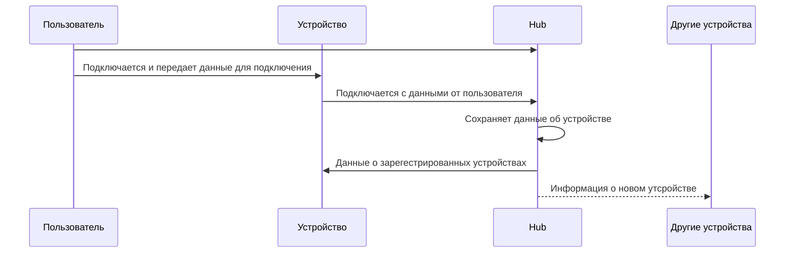

# V1

## General

### Подключение устройств

### Общая схема работы

#### Маршрутизация
После построения сети устройство должно знать куда отправить пакет,
чтобы он дошел до получателя. Условно у каждого устройство будет таблица маршрутизации
формата 

| Куда надо отправить пакет | Сосед |
| ------------------------- | ----- |
| 1.1                       | 1.5   |
| 1.23                      | 1.23  |
| ...                       | ...   |

> [!note]
> Подсети будут реализованы позже

Максимум в подсети может быть до 255 устройств, чтобы попадать в другие подсети
будет предусмотрена еще одна таблица маршрутизации.

| Устройство данной сети     | Сети к которым есть доступ |
| -------------------------- | -------------------------- |
| 1.20                       | 1 \| 3 \| 16               |

Количество подсетей ограничено 16-ю.

#### Подключение нового устройства
1) Все устройства уведомляются о подключении нового
2) Пересобирается сеть

### Построение сети

#### Параметры связей

## Симуляция