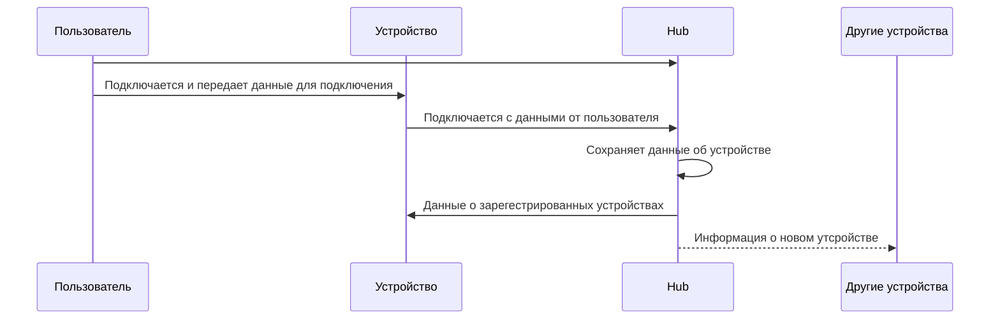

# DevLog V1

## General

### Подключение устройств

### Общая схема работы

#### Подключение нового устройства

1. Все устройства уведомляются о подключении нового
2. Пересобирается сеть

### Построение сети

1. Фаза инициализации
   - Устройства подключаются к хабу для регистрации
   - Хаб присваивает ID и собирает базовую информацию
   - Устройства перемещаются в целевые местоположения
2. Фаза обнаружения соседей
   - Каждое устройство сканирует эфир для поиска соседей
   - Составляется таблица соседей с RSSI каждого соединения
   - Определяется возможность прямого соединения с хабом
3. Фаза базового соединения
   - Устройства устанавливают предварительные соединения
   - Если хаб недоступен напрямую - ищут пути через соседей
   - Формируется минимальная связная сеть
4. Фаза оптимизации (муравьиный алгоритм)
   - По команде от хаба начинается оптимизация
   - Устройства периодически отправляют "муравьев" к хабу
   - Муравьи выбирают путь на основе `парамтеров связи`
5. Фаза обновления феромонов
   - Успешные муравьи возвращаются по своим путям
   - Усиливается феромон на успешных маршрутах
   - Происходит испарение феромона на всех ребрах
   - Плохие пути постепенно "забываются"
6. Фаза финализации
   - После стабилизации сети хаб анализирует лучшие пути
   - Рассылает финальные таблицы маршрутизации
   - Устройства переходят в рабочий режим
7. Рабочий режим
   - Данные передаются по оптимизированным путям
   - Фоновая отправка "дежурных" муравьев для мониторинга
   - Локальная адаптация при изменении условий
8. Фаза перестроения (по триггерам)
   - При потере связи или ухудшении метрик
   - Локальный перезапуск муравьиного алгоритма
   - Быстрое восстановление оптимальных путей

#### Параметры связей

- RSSI (Received Signal Strength Indicator) - Индикатор уровня принимаемого сигнала
- Packet loss rate - отношение потерянных пакетов к общему числу отправленных пакетов
- Уровень заряда батареи [0;1]
- Тип питания (от батареи, от сети)
- Минимальная дальность (hops) до хаба
- Степень устройства в графе сети
- Latency

## Симуляция

# V2

## В чем суть-то

На базе ESP8266 и протокола [ESP-NOW](https://www.espressif.com/en/solutions/low-power-solutions/esp-now) построить самоорганизующуюся сеть из конечных устройств. Сеть должна быть оптимальной, а отпимальность достигаться за счет применения роевого интеллекта (ACO).

## Инициализация

Надо как-то построить хоть какой-то граф (дерево) перед тем как
запускать на нем какие-то алгоритмы.
Основная идея такая:

0. В любом случае инициализируем устройство в хабе
1. Устройства который имеют доступ к хабу, подключаются к хабу
2. Допустим мы зарегестрировали устройство $D_{new}$ и его радиус действия не достаёт до хаба, тогда надо послать широковещательную расслыку на поиск $D_{new}$
   И у нас есть 3 пути исхода:

   1. Никакие устройства не нашли $D_{new}$:
      Откладываем обнаружение на $\Delta t_{device-search-delay}$ и пробуем снова через это время
   2. Только одно устройство нашло $D_{new}$:
      Подключаем $D_{new}$ к этому устройству
   3. Несколько устройств нашло $D_{new}$:
      Подключаем сначала ближайшее к хабу (по количеству хопов), затем менее нагруженное (у которого меньше всего связей с другими)

   Для пунктов 2 и 3 ситуацию когда все подключения на всех устройствах, которые видят $D_{new}$, забиты под завязку будем рассматривать как патовую

# V3

Симуляция переписана на Blazor
