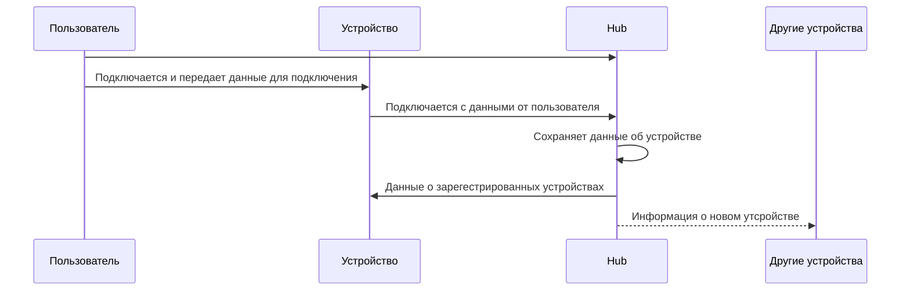
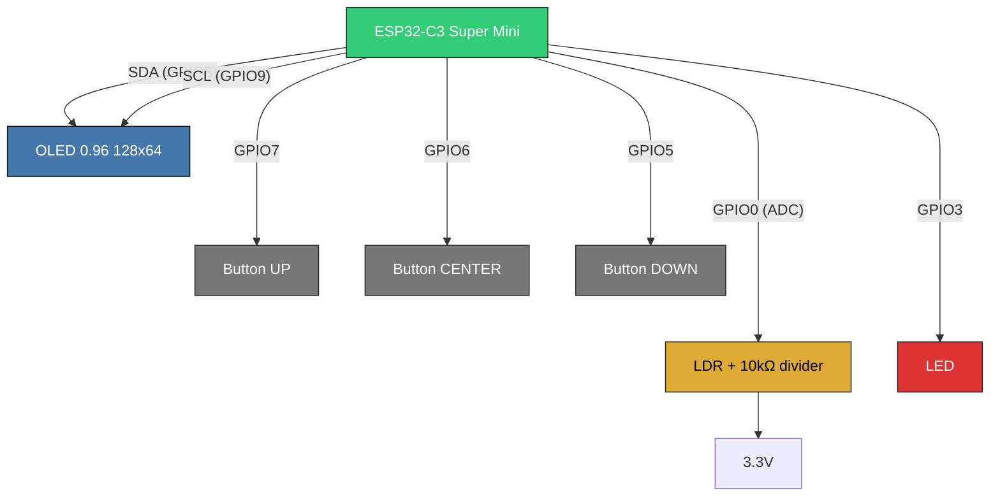

# DevLog V1

## General

### Подключение устройств



### Общая схема работы

#### Подключение нового устройства

1. Все устройства уведомляются о подключении нового
2. Пересобирается сеть

### Построение сети

1. Фаза инициализации
   - Устройства подключаются к хабу для регистрации
   - Хаб присваивает ID и собирает базовую информацию
   - Устройства перемещаются в целевые местоположения
2. Фаза обнаружения соседей
   - Каждое устройство сканирует эфир для поиска соседей
   - Составляется таблица соседей с RSSI каждого соединения
   - Определяется возможность прямого соединения с хабом
3. Фаза базового соединения
   - Устройства устанавливают предварительные соединения
   - Если хаб недоступен напрямую - ищут пути через соседей
   - Формируется минимальная связная сеть
4. Фаза оптимизации (муравьиный алгоритм)
   - По команде от хаба начинается оптимизация
   - Устройства периодически отправляют "муравьев" к хабу
   - Муравьи выбирают путь на основе `парамтеров связи`
5. Фаза обновления феромонов
   - Успешные муравьи возвращаются по своим путям
   - Усиливается феромон на успешных маршрутах
   - Происходит испарение феромона на всех ребрах
   - Плохие пути постепенно "забываются"
6. Фаза финализации
   - После стабилизации сети хаб анализирует лучшие пути
   - Рассылает финальные таблицы маршрутизации
   - Устройства переходят в рабочий режим
7. Рабочий режим
   - Данные передаются по оптимизированным путям
   - Фоновая отправка "дежурных" муравьев для мониторинга
   - Локальная адаптация при изменении условий
8. Фаза перестроения (по триггерам)
   - При потере связи или ухудшении метрик
   - Локальный перезапуск муравьиного алгоритма
   - Быстрое восстановление оптимальных путей

#### Параметры связей

- RSSI (Received Signal Strength Indicator) - Индикатор уровня принимаемого сигнала
- Packet loss rate - отношение потерянных пакетов к общему числу отправленных пакетов
- Уровень заряда батареи [0;1]
- Тип питания (от батареи, от сети)
- Минимальная дальность (hops) до хаба
- Степень устройства в графе сети
- Latency

## Симуляция

# V2

## В чем суть-то

На базе ESP8266 и протокола [ESP-NOW](https://www.espressif.com/en/solutions/low-power-solutions/esp-now) построить самоорганизующуюся сеть из конечных устройств. Сеть должна быть оптимальной, а отпимальность достигаться за счет применения роевого интеллекта (ACO).

## Инициализация

Надо как-то построить хоть какой-то граф (дерево) перед тем как
запускать на нем какие-то алгоритмы.
Основная идея такая:

0. В любом случае инициализируем устройство в хабе
1. Устройства который имеют доступ к хабу, подключаются к хабу
2. Допустим мы зарегестрировали устройство $D_{new}$ и его радиус действия не достаёт до хаба, тогда надо послать широковещательную расслыку на поиск $D_{new}$
   И у нас есть 3 пути исхода:

   1. Никакие устройства не нашли $D_{new}$:
      Откладываем обнаружение на $\Delta t_{device-search-delay}$ и пробуем снова через это время
   2. Только одно устройство нашло $D_{new}$:
      Подключаем $D_{new}$ к этому устройству
   3. Несколько устройств нашло $D_{new}$:
      Подключаем сначала ближайшее к хабу (по количеству хопов), затем менее нагруженное (у которого меньше всего связей с другими)

   Для пунктов 2 и 3 ситуацию когда все подключения на всех устройствах, которые видят $D_{new}$, забиты под завязку будем рассматривать как патовую

# V3

Симуляция переписана на Blazor

# Описание Data

Устройство при регистрации будет сохранять описанный в ней протокол взаимодействия:

```json
[
  {
    "n": "",
    "t": "",
    "f": ""
  }
]
```

- `n` - имя через которое происходит управление
- `t` - тип устройства `1` - устройство вывода, `2` - устройства ввода
- `f` - формат может иметь следующие значения:
  - `b` - логическое значение 0/1
  - `i` - целое число
  - `f` - знаковое число
  - `e:v1/v2/...` - перечисление со значениями v1, v2 и т.д

Запрос на получение состояния устройства ввода/вывода: `name/`.
Ответ на запрос на получение состояния устройства ввода: `name/value`.
Команда на установку состояния устройству вывода: `name/value`

Данный протокол должен высылаться каждый раз при неудачной попытке обращения к устройтсву.

# Фишечки

Нам никогда не понадобиться передавать и обрабатывать данные между двумя конечными устройствами,
поэтому можно делать расчет на то, что данный будет передаваться от хаба к конечному устройству и наоборот.
В связи с этим я придумал следующий вариант. Структура будет древовидная с корнем в Hub.
Данные от Hub будут передаваться широковещательно и нести за собой `заряд`, а древовидная структура поможет избежать слишком большого количества сообщений.
Данные от конечных устройств будут подниматься вверх по дереву с приоритетом на `заряд`.

# Построение сети

Сеть будет строиться таким образом:

0. Устройства должны быть зарегестрированны у хаба чтобы они могли подключаться в сеть, тогда пускай у нас уже зарегестрированно но не подключено n конечных устройств.
1. Хаб знает устройтсва которые непосредственно подключены к нему (а мы стараемся подключать к хабу все устройства которые могут к нему подключиться напрямую).
2. Хаб отправляет `FIND` запросы подключенным устройствам.
3. Устройства при получении запроса:
   1. Производят попытку подключения
   2. При успехе отсылают обратно запрос об успехе
   3. Рассылают запроос дальше
4. Хаб получает все наборы (устройство которое нашло, какое оно устройтсво нашло), далее из этого набора он выстраивает сеть по принципу наименьшего количества хопов. Далее хаб для каждой пары посылает запросы `CONNECT`/`DISCONNECT`. Для `CONNECT` запросов устройства обмениваются информацией о друг друге и закрпляются связью. Для `DISCONNECT` отключают свзяь с устройством.
5. Для всех устройств которые не были найдены ни одним устройством производим попытку подключения раз в `t_rtc`.

# Система зарядов

Каждый раз вместе с пакетом от HUB будет идти заряд, который будет рассеиваться и накапливаться на устройствах и отправляться дальше.
Таким образом устройства с большим зарядом/потенциалом будут теоретически ближе к хабу чем остальные.

# Устройство с ESP32C3 super mini


