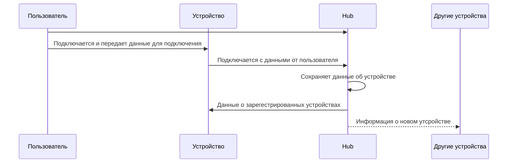

# Ideas

## General

### Подключение устройств

```mermaid
sequenceDiagram
    participant u as Пользователь
    participant d as Устройство
    participant h as Hub
    participant dd as Другие устройства
    
	u ->> h: 
	u ->> d: Подключается и передает данные для подключения
	d ->> h: Подключается с данными от пользователя
	h ->> h: Сохраняет данные об устройстве
	h ->> d: Данные о зарегестрированных устройствах
	h -->> dd: Информация о новом утсройстве
```