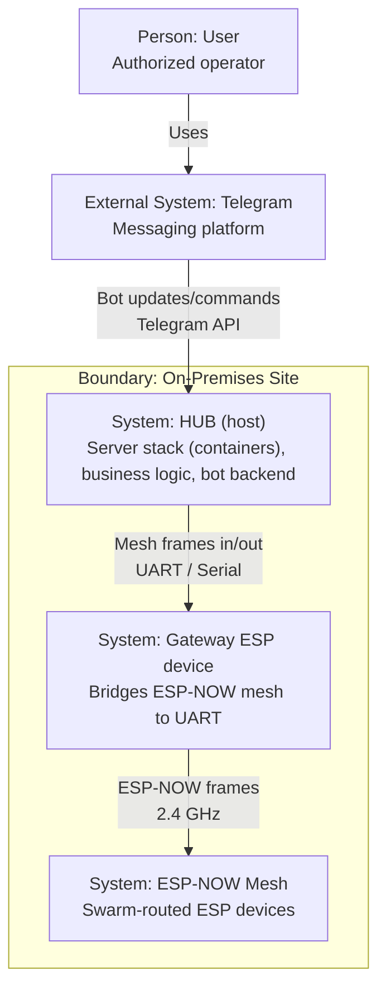
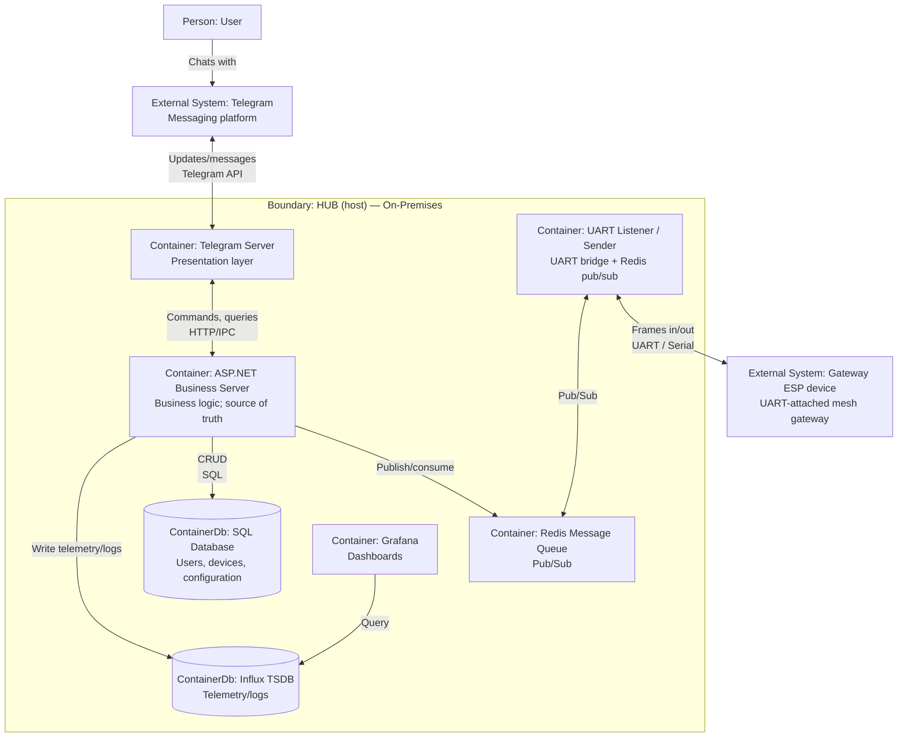
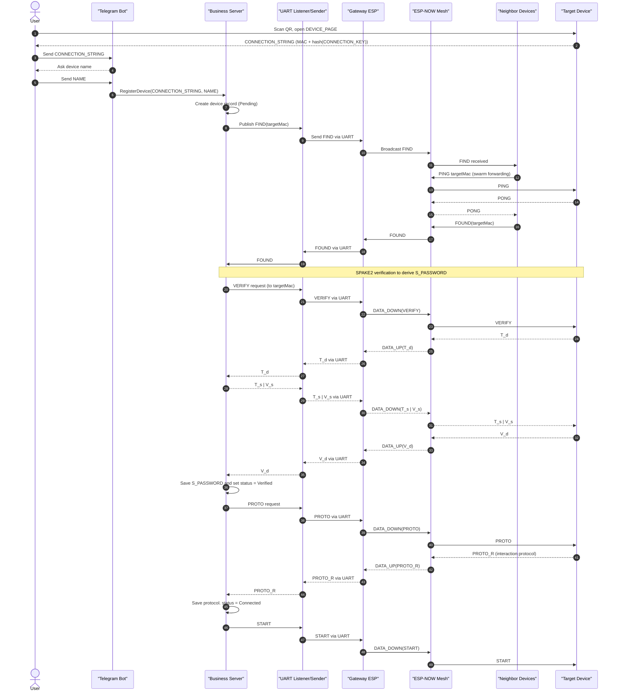

# Protocol

> Protocol for creating secure ESP-NOW mesh for IoT, based on swarm intelligence principles and controlling over telegram

## Overview

### Problem

The project targets an IoT deployment where many ESP devices must communicate over **ESP-NOW** as a self-organizing mesh, while being **remotely managed by a small set of authorized users** via Telegram.

Key constraints and challenges:

- The solution should remain **fully on-premises**: core functionality must work without any cloud dependency and can operate **without Internet access** (local host + local radio network).
- ESP-NOW provides link-layer delivery but does not provide end-to-end device identity, authorization, or a mesh routing scheme.
- Devices can be multi-hop away from the gateway, and topology can change; routes should emerge without maintaining global routing tables.
- Intermediate forwarders must be able to modify routing metadata (e.g., `ttl`, last hop), without breaking end-to-end authenticity.
- Device onboarding must be secure and user-friendly (QR + one-time connection string), with a way to bind a physical device to a server-side record.
- The system is **closed**: access control, roles, and audit/logging matter as much as packet delivery.

Why ESP-NOW (vs “regular” Wi‑Fi networking) is attractive for this use case:

- No access point (AP) is required for basic device-to-device delivery: the mesh can exist even where there is no Wi‑Fi infrastructure.
- Lower connection/management overhead than IP networking in small payload/command scenarios (no DHCP/TCP stack requirement), which is useful for constrained devices.
- Direct addressing by MAC and a small frame model fits a hop-by-hop forwarding design.

Trade-offs to accept up front:

- Smaller payload budget per frame and more responsibility on the protocol (fragmentation/ordering/application semantics if needed).
- Channel/interference constraints are shared with 2.4 GHz Wi‑Fi; reliability is topology- and environment-dependent.

### Solution

The solution is a **two-layer protocol** plus a hub backend:

1. **Architecture**
   - **Mesh**: ESP devices exchange frames over ESP-NOW.
   - **Gateway device**: one ESP node physically connected to the host via UART; it bridges mesh traffic to the server.
   - **HUB (host)**: PC / Raspberry Pi / laptop running the server stack; user interacts through a Telegram bot.

   The entire system is designed to run **on-premises**: the HUB (host), databases, and bot backend live locally. Internet access is not required for the mesh itself; remote control can be provided via Telegram when connectivity exists, but the networking and security model do not depend on a cloud service.

2. **Secure onboarding (device registration)**
   - A device exposes a configuration page (from QR) that yields a `CONNECTION_STRING` containing the device MAC and a hash of a random `CONNECTION_KEY`.
   - The user sends the `CONNECTION_STRING` to the bot; the server broadcasts `FIND` to locate the device.
   - The server and device perform **SPAKE2** to derive a per-device secret `S_PASSWORD`.
   - After verification, the server fetches the device's **Interaction Protocol** (`PROTO/PROTO_R`) and moves the device to `Connected`, then sends `START`.

3. **End-to-end message authenticity (server ↔ device)**
   - After SPAKE2, device commands and telemetry are authenticated with `HMAC(S_PASSWORD, SECURE_HEADER | PAYLOAD)`.
   - Replay protection uses a per-session `seq` validated by endpoints.

4. **Mesh forwarding (swarm routing)**
   - Each ESP-NOW frame uses a split header: a **mutable** `ROUTING_HEADER` (not covered by end-to-end HMAC) and an **immutable** `SECURE_HEADER` + payload (covered by HMAC).
   - Forwarding is **charge-based**: nodes propagate packets to the top 50% neighbors by charge, using `q_up` for traffic towards the gateway and `q_total` for traffic from the gateway.
   - A network-wide `DECAY` epoch prevents unbounded charge growth and helps convergence.

Why a swarm-style, charge-based approach (vs common alternatives) is a good fit here:

- **No global routes**: nodes keep only neighbor state, which scales better than maintaining full routing tables on constrained devices.
- **Topology tolerance**: multi-path propagation to the “top neighbors” is more resilient than a strict tree where a single parent failure can isolate a subtree.
- **Less waste than flooding**: selecting only a fraction of neighbors reduces the broadcast-storm behavior while still keeping redundancy.
- **Self-stabilization**: `DECAY` prevents unbounded metric growth and helps the network re-balance when conditions change.

As with any mesh routing, this is a trade-off: compared to a single-path route, it can use more airtime due to controlled replication. The protocol mitigates this with `ttl` and deduplication (`(originMac, msgId)` cache).

Note: the document specifies authenticity/integrity via HMAC; payload encryption/confidentiality is not defined here.

## Global Architecture

1. Network of ESP devices connected as mesh with ESP-NOW
2. Gateway ESP device (one of the mesh devices) that bridges the mesh to the host
3. HUB (host): PC/Raspberry PI/Laptop which is running all server logic
4. User interacts via Telegram with the bot running on the host

Gateway device and HUB (host) are connected physically and interact with each other via UART (Serial)



### HUB Architecture

Everything is intended to run in different Docker containers

1. UART Listener / Sender
   Would listen COM port to read serial data came from gateway device (from network)
   Would listen Redis Message queue to send data through gateway device to network
2. Redis Message Queue
   Queue with pub/sub messages to exchange between server and network
   The only way server can interact with UART Listener / Sender
3. ASP.NET Business Server
   Main business logic handler and the only source of logic and data (the only point connected to database)
4. SQL Database
   To store data (like users, devices etc.)
5. Influx Time-Series Database (TSDB)
   To store logs about work of devices
6. Grafana
   To visualize TSDB data
7. Telegram Server
   Is the main way user would interact with the system, presentation layer of whole project



## Users

IoT is a closed system so there must be a restricted and very limited access on who can rule this

> [!important] Rule
> The first user connected to the bot with a `/start` command is an admin.

So that if the real admin wasn't a first user, he can reset the telegram bot and try unlimited number of times.

### Register users

An admin in any moment can CRUD users from the telegram bot. He can add user by sending a mention so that next time this user will write a message to the bot he will be added to system. Also admin can grant dedicated_admin role to any other user. So here are 3 roles matrix:

**Users**
Can send requests to devices and read info about devices

**Dedicated Admins**
Can do what users do. Also can CRUD devices and other users

**Admins**
Can do what dedicated admins do. Also can grant and withdraw dedicated admin roles

## Devices

### Register device

- Every device has a QR code with credentials to connect to its Wi-Fi, as well as a DEVICE_PAGE that generates a CONNECTION_STRING (consisting of the MAC address of the device and a SHA256 hash of random CONNECTION_KEY in a base64 format)
- The user needs to scan this QR code and open the device's configuration page, where they must copy the CONNECTION_STRING
- The user sends this CONNECTION_STRING to the telegram bot
- The bot asks user how he want to name this device
- The bot captures the CONNECTION_STRING and NAME and sends a request to the server to handle the device connection
- The server creates a device record with DeviceConnectionStatus::Pending
- Then the server creates a broadcast FIND message to find this device
- Every device which gets FIND request tries to find the target device by sending PING requests
- If a device receives a PONG response, it notifies the server that the device has been found with FOUND message

---

**SPAKE2**:

> There are predefined in code:
>
> > elliptic curve (based on point G)
> > random points M, N
>
> S - server
> D - device

```txt
S -> D : VERIFY request

D: w = SHA256(CONNECTION_KEY)
   generates random x
   T_d = x * G + w * M

D -> S : T_d

S: generates random y
   T_s = y * G + w * N
   S_PASSWORD = y * (T_d - w * M) = y * x * G
   V_s = HMAC(S_PASSWORD, "SERVER_OK")

S -> D : T_s | V_s

D: S_PASSWORD = x * (T_s - w * N) = x * y * G
   V_s' = HMAC(S_PASSWORD, "SERVER_OK")
   CHECK: V_s ?= V_s' (if not -> terminate)
   V_d = HMAC(S_PASSWORD, "DEVICE_OK")

D -> S : V_d

S: V_d' = HMAC(S_PASSWORD, "DEVICE_OK")
   CHECK: V_d ?= V_d' (if not -> terminate)
```

---

[From now on, every request and response is signed with HMAC based on the S_PASSWORD]

- The server saves S_PASSWORD and changes device's record status to DeviceConnectionStatus::Verified
- The server sends a PROTO request to retrieve the interaction protocol data from the device
- The device sends its protocol data with PROTO_R message
- The server saves this data and changes the device record's status to DeviceConnectionStatus::Connected
- The server sends START command to device

#### Interaction Protocol

Array of all elements of the device

```json
[
  {
    "n": "",
    "t": "",
    "f": ""
  }
]
```

- `n` - element name
- `t` - type: `O` - output, `I` - input
- `f` - data format:
  - `b` - boolean 0/1
  - `i` - integer
  - `f` - float [0,1]
  - `e:v1;v2;...` - enum with values: v1, v2 etc.
  - `s` - string

For each element would be creates map id:name

Request of state of the element: `id/g/`.
Response for request of state of the element: `id/gr/value`.

Request for setting value for Output element: `id/s/value`
Response for setting value for Output element: `id/sr/value`

Message from device with data generated ones in a while (e.g. temperature sensor): `id/e/value`



## Network

### Message security

This protocol has 2 logical layers:

1. **End-to-end security** between HUB (server side) and a specific device.
2. **Mesh routing header** used for forwarding inside ESP-NOW mesh.

Because routing metadata (like `TTL`, `prevHop`, `charge`) is modified by intermediate nodes, end-to-end HMAC must cover only the immutable part of the message.

#### Keys

- `S_PASSWORD` - per-device secret generated during SPAKE2 (device <-> server). Used for end-to-end HMAC of device commands and telemetry.

#### Message envelope

Every ESP-NOW frame carries a single protocol message with the following logical structure:

```txt
ROUTING_HEADER | SECURE_HEADER | PAYLOAD | TAG
```

**ROUTING_HEADER** (mutable, can change on every hop; NOT included into end-to-end HMAC):

- `ver` - protocol version
- `ttl` - hop limit (decremented on each forward)
- `prevHopMac` - MAC of the sender of this hop
- `charge` - routing metric value advertised by `prevHopMac` (see Swarm routing)
- `decayEpochHint` - last decay epoch known by sender (helps convergence)

**SECURE_HEADER** (immutable during forwarding; included into end-to-end HMAC):

- `dir` - `UP` (to gateway) or `DOWN` (from gateway)
- `msgType` - message type
- `originMac` - MAC of the original sender (stays constant across hops)
- `dstMac` - target MAC, or broadcast address for mesh-control.
  - For link-layer broadcast control messages, use `dstMac = FF:FF:FF:FF:FF:FF`.
- `msgId` - message id unique per `originMac` (used for dedup/loop prevention)
- `seq` - per-session sequence number for end-to-end anti-replay

**PAYLOAD** - message payload bytes (application-level or mesh-control-level).

**TAG** - authentication tag:

- For end-to-end messages: `TAG = HMAC(S_PASSWORD, SECURE_HEADER | PAYLOAD)`

Mesh-control message authentication is not specified in this document.

Intermediate nodes MUST NOT modify `SECURE_HEADER` or `PAYLOAD`.

#### Byte sizes

This section defines the binary sizes of each field so the remaining bytes for `PAYLOAD` can be calculated.

`ESP_NOW_MAX` is the maximum number of bytes available for this protocol message in a single ESP-NOW frame. Treat it as a platform/config parameter.

Fixed sizes:

**ROUTING_HEADER**:

- `ver`: 1 byte (`uint8`)
- `ttl`: 1 byte (`uint8`)
- `prevHopMac`: 6 bytes
- `charge`: 2 bytes (`uint16`, normalized charge)
- `decayEpochHint`: 2 bytes (`uint16`)

Total `ROUTING_HEADER_LEN = 12` bytes.

**SECURE_HEADER**:

- `dir`: 1 byte (`uint8`)
- `msgType`: 1 byte (`uint8`)
- `originMac`: 6 bytes
- `dstMac`: 6 bytes
- `msgId`: 2 bytes (`uint16`)
- `seq`: 2 bytes (`uint16`)

Total `SECURE_HEADER_LEN = 18` bytes.

**TAG**:

- `TAG_LEN`: 16 bytes (HMAC-SHA256 truncated to 16 bytes)

Total envelope overhead:

`OVERHEAD_LEN = ROUTING_HEADER_LEN + SECURE_HEADER_LEN + TAG_LEN = 46` bytes.

Available payload per single ESP-NOW frame:

`PAYLOAD_MAX = ESP_NOW_MAX - OVERHEAD_LEN`

Example (if `ESP_NOW_MAX = 250`): `PAYLOAD_MAX = 204` bytes.

#### Replay protection and deduplication

- Endpoints (server/device) MUST validate `seq` to reject replays for end-to-end messages.
- All nodes (including intermediate forwarders) MUST keep a fixed-size cache of the last `N` seen `(originMac, msgId)` pairs.
  - If an incoming message is already in cache, it MUST be dropped.
  - Cache is size-based (last `N` entries), not time-based.

This cache is required to prevent loops and storms in swarm routing.

### Swarm routing (charge-based)

The mesh is self-organizing. Devices do not store global routes. Each device stores only neighbor MACs and two charge values.

#### Definitions

- **Gateway** is the ESP device physically connected to HUB over UART. Its MAC address is fixed and considered the root of the mesh for `UP` direction.
- `q_up` - charge used to route messages **towards gateway** (`dir=UP`). Intuition: higher means "more traffic successfully flows to gateway through this node".
- `q_total` - charge used to route messages **from gateway** (`dir=DOWN`). Intuition: higher means "more central / more traffic goes through this node overall".

Each device maintains:

- Neighbor table: `neighbors[mac] = { q_up, q_total, lastSeen }`
- Local charges: `q_up_self`, `q_total_self`
- `lastDecayEpoch` - last applied decay epoch number
- `seenCache` - fixed-size cache of last `N` `(originMac, msgId)`

#### Charge advertisement

Each hop advertises its local charge to neighbors:

- For a forwarded `dir=UP` packet, sender sets `ROUTING_HEADER.charge = q_up_self`.
- For a forwarded `dir=DOWN` packet, sender sets `ROUTING_HEADER.charge = q_total_self`.

When a device receives a packet from neighbor `A`, it updates neighbor charges from the routing header:

- If `dir=UP` then `neighbors[A].q_up = max(neighbors[A].q_up, charge)`
- If `dir=DOWN` then `neighbors[A].q_total = max(neighbors[A].q_total, charge)`

Implementations MAY use smoothing instead of `max`, but the protocol expects monotonic convergence.

#### Charge accumulation

Charges grow based on how much traffic passes through a node:

- When a device forwards a `dir=UP` message: increment `q_up_self` and `q_total_self`.
- When a device forwards a `dir=DOWN` message: increment `q_total_self`.

Exact increment function is implementation-defined.

#### Forwarding rule (top 50%)

When a device receives a packet that is not for itself:

1. Drop if `ttl == 0`.
2. Drop if `(originMac, msgId)` is already in `seenCache`.
3. Otherwise, decrement `ttl` and forward.

Forwarding target selection:

- If `dstMac` is a direct neighbor: unicast to `dstMac`.
- Otherwise, select neighbors excluding `prevHopMac`.
  - For `dir=UP`: sort by `neighbors[mac].q_up` descending.
  - For `dir=DOWN`: sort by `neighbors[mac].q_total` descending.
  - Forward to the top `ceil(0.5 * neighborCount)` neighbors (minimum 1).

This is not a broadcast; it is a swarm-propagation step.

#### Charge decay (network-wide)

To prevent unbounded charge growth and to provide a global dedup primitive, the network supports a decay epoch.

Mesh-control message:

- `msgType = DECAY`
- Payload: `{ decayEpoch, percent }`

Rules:

- Every device stores `lastDecayEpoch`.
- Upon receiving `DECAY` with epoch `E`:
  - If `E <= lastDecayEpoch`: ignore.
  - If `E > lastDecayEpoch`: apply decay `(E - lastDecayEpoch)` times:
    - `q_up_self *= (1 - percent)`
    - `q_total_self *= (1 - percent)`
    - also decay stored neighbor charges
  - Set `lastDecayEpoch = E`.
  - Forward this `DECAY` message further using the standard forwarding rules (dedup by `(originMac,msgId)` + `ttl`).

Devices MAY also apply decay locally on startup by requesting/learning the latest epoch (using `decayEpochHint` observed in traffic).

#### Minimal message types (network level)

- `HELLO` - optional presence announcement (helps `neighbors.lastSeen`).
- `BEACON` - gateway-originated link-layer broadcast used to help the mesh converge after join/reboot/partition.
- `WAKE` - device-originated link-layer broadcast on wake from deep sleep (helps re-attach after sleep/path loss).
- `DATA_UP` - device -> gateway (telemetry/events/responses).
- `DATA_DOWN` - gateway -> device (commands/queries).
- `DECAY` - network-wide charge decay.
