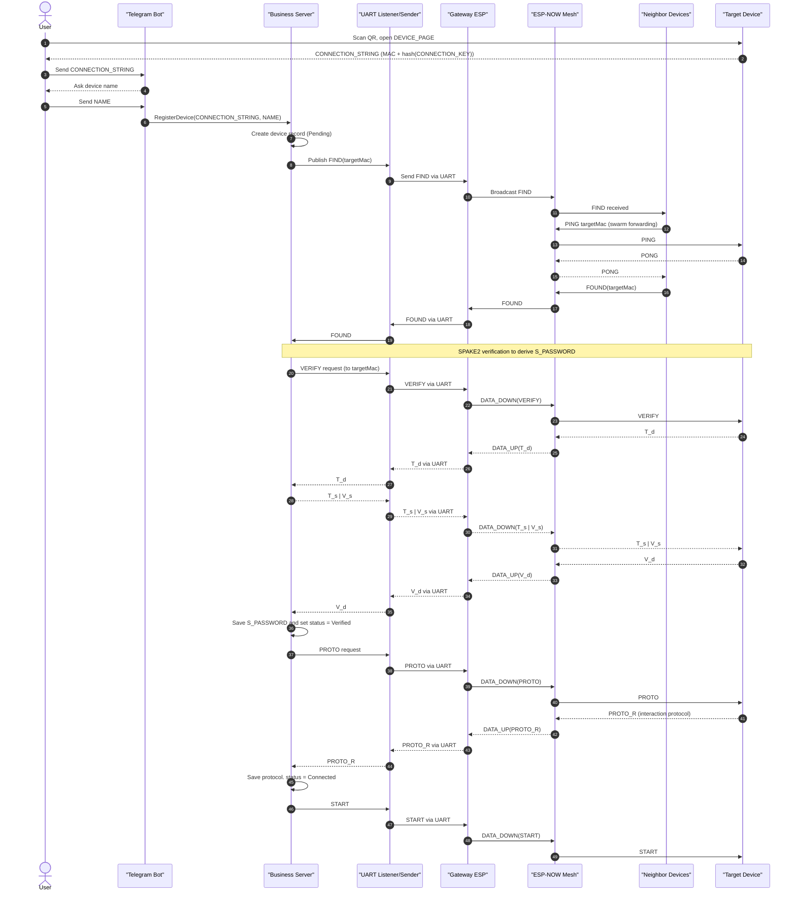

# Onboarding (Register device)

## Register device

- Every device has a QR code with credentials to connect to its Wi-Fi, as well as a DEVICE_PAGE that generates a CONNECTION_STRING (consisting of the MAC address of the device and a SHA256 hash of random CONNECTION_KEY in a base64 format)
- The user needs to scan this QR code and open the device's configuration page, where they must copy the CONNECTION_STRING
- The user sends this CONNECTION_STRING to the telegram bot
- The bot asks user how he want to name this device
- The bot captures the CONNECTION_STRING and NAME and sends a request to the server to handle the device connection
- The server creates a device record with DeviceConnectionStatus::Pending
- Then the server creates a broadcast FIND message to find this device
- Every device which gets FIND request tries to find the target device by sending PING requests
- If a device receives a PONG response, it notifies the server that the device has been found with FOUND message

---

## SPAKE2

**SPAKE2**:

> There are predefined in code:
>
> > elliptic curve (based on point G)
> > random points M, N
>
> S - server
> D - device

```txt
S -> D : VERIFY request

D: w = SHA256(CONNECTION_KEY)
   generates random x
   T_d = x * G + w * M

D -> S : T_d

S: generates random y
   T_s = y * G + w * N
   S_PASSWORD = y * (T_d - w * M) = y * x * G
   V_s = HMAC(S_PASSWORD, "SERVER_OK")

S -> D : T_s | V_s

D: S_PASSWORD = x * (T_s - w * N) = x * y * G
   V_s' = HMAC(S_PASSWORD, "SERVER_OK")
   CHECK: V_s ?= V_s' (if not -> terminate)
   V_d = HMAC(S_PASSWORD, "DEVICE_OK")

D -> S : V_d

S: V_d' = HMAC(S_PASSWORD, "DEVICE_OK")
   CHECK: V_d ?= V_d' (if not -> terminate)
```

---

## After SPAKE2

[From now on, every request and response is signed with HMAC based on the S_PASSWORD]

- The server saves S_PASSWORD and changes device's record status to DeviceConnectionStatus::Verified
- The server sends a PROTO request to retrieve the interaction protocol data from the device
- The device sends its protocol data with PROTO_R message
- The server saves this data and changes the device record's status to DeviceConnectionStatus::Connected
- The server sends START command to device

## Interaction Protocol

Array of all elements of the device

```json
[
  {
    "n": "",
    "t": "",
    "f": ""
  }
]
```

- `n` - element name
- `t` - type: `O` - output, `I` - input
- `f` - data format:
  - `b` - boolean 0/1
  - `i` - integer
  - `f` - float [0,1]
  - `e:v1;v2;...` - enum with values: v1, v2 etc.
  - `s` - string

For each element would be creates map id:name

Request of state of the element: `id/g/`.
Response for request of state of the element: `id/gr/value`.

Request for setting value for Output element: `id/s/value`
Response for setting value for Output element: `id/sr/value`

Message from device with data generated ones in a while (e.g. temperature sensor): `id/e/value`

## Sequence diagram


