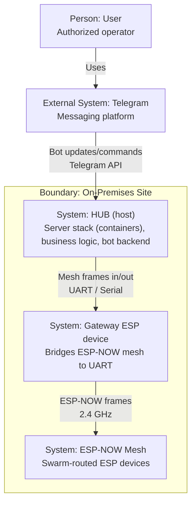

# Architecture

## Global Architecture

1. Network of ESP devices connected as mesh with ESP-NOW
2. Gateway ESP device (one of the mesh devices) that bridges the mesh to the host
3. HUB (host): PC/Raspberry PI/Laptop which is running all server logic
4. User interacts via Telegram with the bot running on the host

Gateway device and HUB (host) are connected physically and interact with each other via UART (Serial)



## HUB Architecture

Everything is intended to run in different Docker containers

1. UART Listener / Sender
   Would listen COM port to read serial data came from gateway device (from network)
   Would listen Redis Message queue to send data through gateway device to network
2. Redis Message Queue
   Queue with pub/sub messages to exchange between server and network
   The only way server can interact with UART Listener / Sender
3. ASP.NET Business Server
   Main business logic handler and the only source of logic and data (the only point connected to database)
4. SQL Database
   To store data (like users, devices etc.)
5. Influx Time-Series Database (TSDB)
   To store logs about work of devices
6. Grafana
   To visualize TSDB data
7. Telegram Server
   Is the main way user would interact with the system, presentation layer of whole project

```mermaid
flowchart TB
   %% HUB Architecture (C4-style using standard Mermaid)

   user["Person: User"]
   telegram["External System: Telegram\nMessaging platform"]
   gateway["External System: Gateway ESP device\nUART-attached mesh gateway"]

   subgraph hubHost["Boundary: HUB (host) — On-Premises"]
      bot["Container: Telegram Server\nPresentation layer"]
      api["Container: ASP.NET Business Server\nBusiness logic; source of truth"]
      redis["Container: Redis Message Queue\nPub/Sub"]
      uart["Container: UART Listener / Sender\nUART bridge + Redis pub/sub"]
      sql[(("ContainerDb: SQL Database\nUsers, devices, configuration"))]
      influx[(("ContainerDb: Influx TSDB\nTelemetry/logs"))]
      grafana["Container: Grafana\nDashboards"]
   end

   api --->|"Write telemetry/logs"| influx
   grafana -->|"Query"| influx
   user -->|"Chats with"| telegram
   telegram <-->|"Updates/messages\nTelegram API"| bot
   bot <-->|"Commands, queries\nHTTP/IPC"| api
   api -->|"CRUD\nSQL"| sql
   api -->|"Publish/consume"| redis
   uart <--->|"Pub/Sub"| redis
   uart <-->|"Frames in/out\nUART / Serial"| gateway


```
