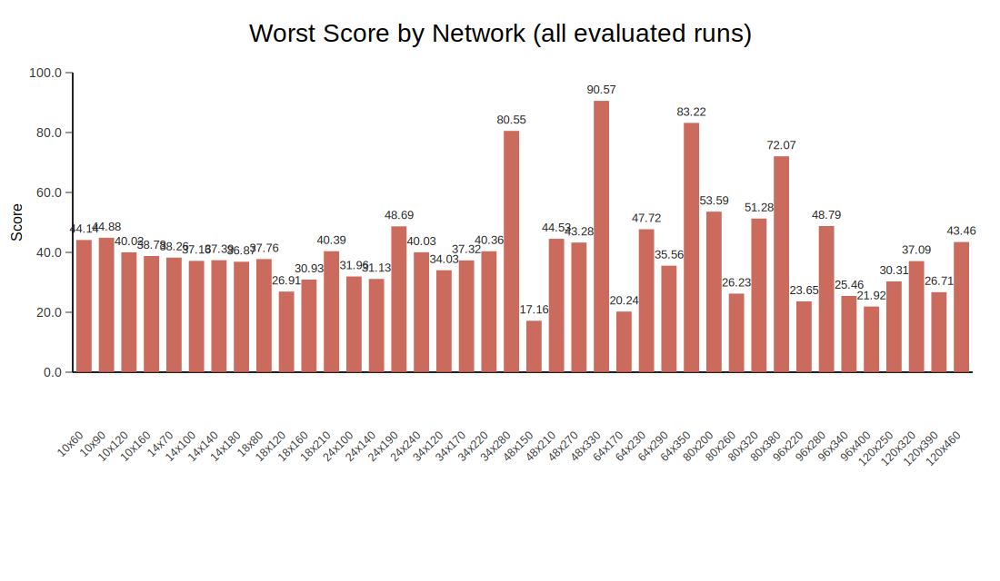
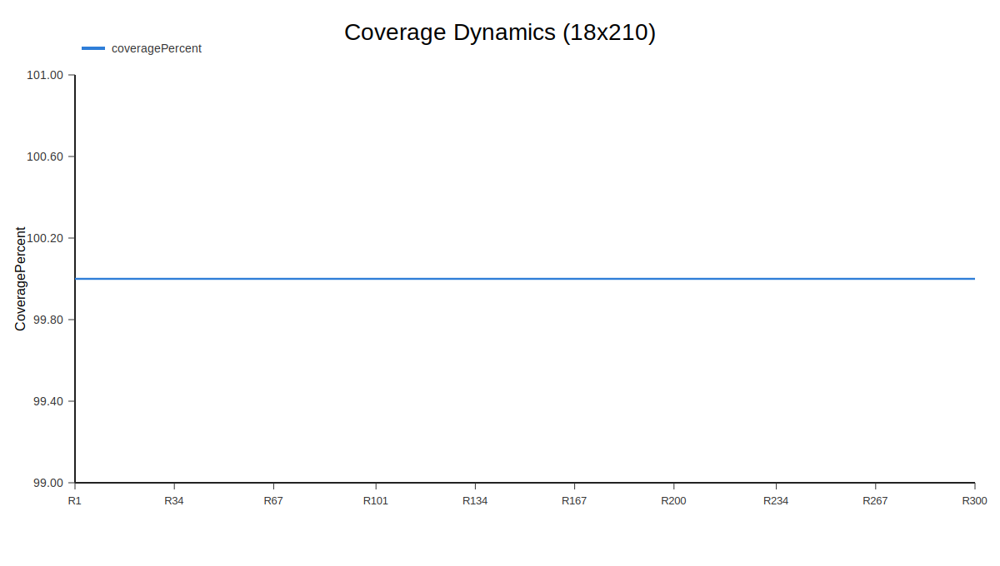
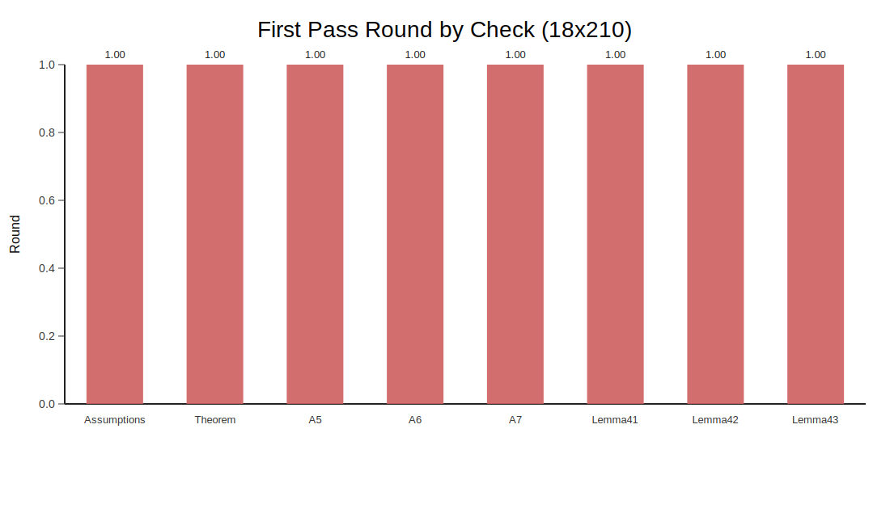
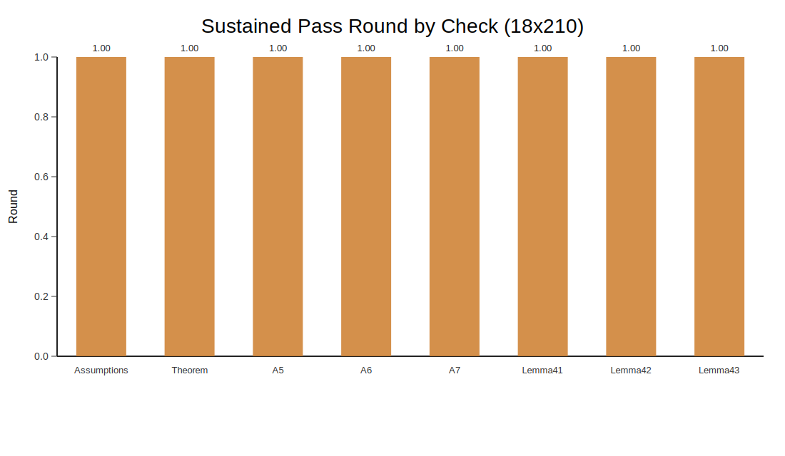

# Batch Run Summary

## Run

- Started: 2026-04-15T22:36:05.610771
- Finished: 2026-04-16T01:23:33.183238
- DurationSec: 10047.57
- Topologies: 40
- TotalRuns: 48800
- OptimizationIterations: 40
- SeedStart: 42
- SeedCount: 10
- RoundsPerCheck: 300
- ParallelWorkers: 5

## Best Recommendation

- Network: N=18, R=210
- Verdict: STABLE
- AvgScore: 100.00
- StableRatio: 1.000
- BestSeed: 42

## Axiom and Theorem Activation by Network

| Network | FirstAssumptions | FirstTheorem | FirstAllChecks | SustainedAssumptions | SustainedTheorem | SustainedAllChecks |
| --- | --- | --- | --- | --- | --- | --- |
| 10x60 | 1 | 1 | 1 | 1 | 1 | 1 |
| 10x90 | 1 | 1 | 1 | 1 | 1 | 1 |
| 10x120 | 2 | 2 | 2 | 2 | 2 | 2 |
| 10x160 | 1 | 1 | 1 | 1 | 1 | 1 |
| 14x70 | 1 | 1 | 1 | 1 | 1 | 1 |
| 14x100 | 1 | 1 | 1 | 1 | 1 | 1 |
| 14x140 | 2 | 2 | 2 | 2 | 2 | 2 |
| 14x180 | 6 | 6 | 6 | 6 | 6 | 6 |
| 18x80 | 1 | 1 | 1 | 1 | 1 | 1 |
| 18x120 | 14 | 14 | 14 | 14 | 14 | 14 |
| 18x160 | 5 | 5 | 5 | 5 | 5 | 5 |
| 18x210 | 1 | 1 | 1 | 1 | 1 | 1 |
| 24x100 | 9 | 9 | 9 | 9 | 9 | 9 |
| 24x140 | 2 | 2 | 2 | 2 | 2 | 2 |
| 24x190 | 1 | 1 | 1 | 1 | 1 | 1 |
| 24x240 | 1 | 1 | 1 | 1 | 1 | 1 |
| 34x120 | 1 | 1 | 1 | 1 | 1 | 1 |
| 34x170 | 1 | 1 | 1 | 1 | 1 | 1 |
| 34x220 | 1 | 1 | 1 | 1 | 1 | 1 |
| 34x280 | 1 | 1 | 1 | 1 | 1 | 1 |
| 48x150 | 1 | 1 | 1 | 1 | 1 | 1 |
| 48x210 | 1 | 1 | 1 | 1 | 1 | 1 |
| 48x270 | 1 | 1 | 1 | 1 | 1 | 1 |
| 48x330 | 1 | 1 | 1 | 1 | 1 | 1 |
| 64x170 | 2 | 2 | 2 | 2 | 2 | 2 |
| 64x230 | 1 | 1 | 1 | 1 | 1 | 1 |
| 64x290 | 1 | 1 | 1 | 1 | 1 | 1 |
| 64x350 | 1 | 1 | 1 | 1 | 1 | 1 |
| 80x200 | 1 | 1 | 1 | 1 | 1 | 1 |
| 80x260 | 1 | 1 | 1 | 1 | 1 | 1 |
| 80x320 | 1 | 1 | 1 | 1 | 1 | 1 |
| 80x380 | 1 | 1 | 1 | 1 | 1 | 1 |
| 96x220 | 1 | 1 | 1 | 1 | 1 | 1 |
| 96x280 | 1 | 1 | 1 | 1 | 1 | 1 |
| 96x340 | 1 | 1 | 1 | 1 | 1 | 1 |
| 96x400 | 1 | 1 | 1 | 1 | 1 | 1 |
| 120x250 | 1 | 1 | 1 | 1 | 1 | 1 |
| 120x320 | 1 | 1 | 1 | 1 | 1 | 1 |
| 120x390 | 1 | 1 | 1 | 1 | 1 | 1 |
| 120x460 | 1 | 1 | 1 | 1 | 1 | 1 |

## Best Network Check Activation Detail

| Check | FirstPassRound | SustainedFromRound | PassRatePercent |
| --- | --- | --- | --- |
| Assumptions | 1 | 1 | 100.00 |
| Theorem | 1 | 1 | 100.00 |
| A5 | 1 | 1 | 100.00 |
| A6 | 1 | 1 | 100.00 |
| A7 | 1 | 1 | 100.00 |
| Lemma41 | 1 | 1 | 100.00 |
| Lemma42 | 1 | 1 | 100.00 |
| Lemma43 | 1 | 1 | 100.00 |

## Input Request

```json
{
  "baseConfig": {
    "nodeCount": 48,
    "linkRadius": 210,
    "seed": 42,
    "maxRounds": 320
  },
  "seedCount": 10,
  "optimizationIterations": 50,
  "roundsPerCheck": 300,
  "matrixText": "10x60,10x90,10x120,10x160,14x70,14x100,14x140,14x180,18x80,18x120,18x160,18x210,24x100,24x140,24x190,24x240,34x120,34x170,34x220,34x280,48x150,48x210,48x270,48x330,64x170,64x230,64x290,64x350,80x200,80x260,80x320,80x380,96x220,96x280,96x340,96x400,120x250,120x320,120x390,120x460",
  "parallelWorkers": 5
}
```

## Charts

### score_by_network


### stable_ratio_by_network


### verdict_distribution


### worst_score_by_network



### unstable_or_oscillating_runs_by_network


### first_all_checks_round_by_network


### sustained_all_checks_round_by_network


### best_network_topology


### best_network_coverage



### best_network_stability


### best_network_connectivity_dynamics


### best_network_routing_dynamics


### best_network_theorem_status


### best_network_checks_status


### best_network_first_pass_round_by_check



### best_network_sustained_pass_round_by_check



### worst_network_topology


### worst_network_connectivity_dynamics


### worst_network_stability


### worst_network_routing_dynamics


### worst_network_theorem_status


### worst_network_checks_status


## Notes

- No additional score rationale for best run.
