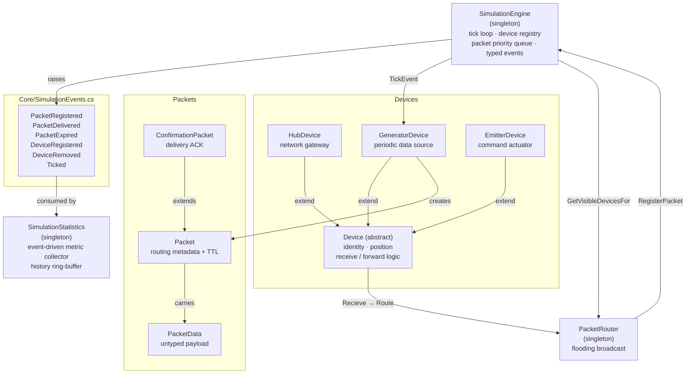
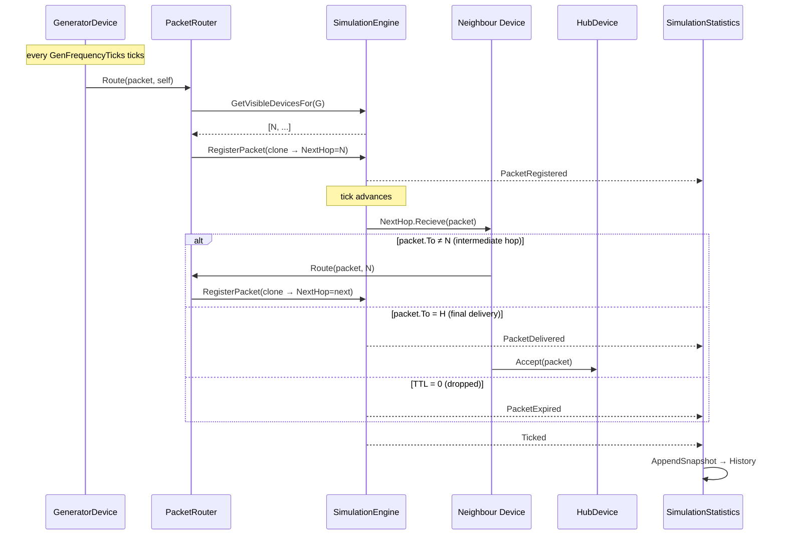

# Engine — IoT Swarm Mesh Simulation Engine

The **Engine** library is the self-contained simulation core of the IoT Swarm Mesh project.  
It models a wireless IoT network on a 2D plane: devices are placed at arbitrary positions, data packets flow between them tick-by-tick, and a flooding broadcast algorithm propagates data toward the central hub.

The library has **no UI dependencies** and can be driven by any host (console, Blazor server, test harness) that calls `SimulationEngine.Instance.Tick()`.

---

## Architecture overview



---

## Key concepts

### Tick-based time model

[`SimulationEngine`](Core/SimulationEngine.cs) is the singleton clock.  
Each call to `Tick()` represents one simulation step:

1. `TickCount` is incremented.  
2. Wall-clock delta time (`dt`) is measured.  
3. `TickEvent` is raised — subscribed devices perform periodic work (e.g. `GeneratorDevice` emitting a packet).  
4. All packets whose `ArrivalTick ≤ TickCount` are dequeued and dispatched to their `NextHop` device.  
5. `Ticked` is raised with the final tick count and `dt` for observers such as `SimulationStatistics`.

### Visibility & routing

Two devices can communicate only when their Euclidean distance is within `SimulationEngine.VisibilityDistance` (default 200 units, configurable at runtime).  
[`PacketRouter`](Routers/PacketRouter.cs) implements a **flooding broadcast**: every packet is cloned and forwarded to *all* visible neighbours of the forwarding device.

### Packet lifetime

A [`Packet`](Packets/Packet.cs) carries a source (`From`), destination (`To`), next-hop device, arrival tick, and a TTL counter.  
Each hop decrements TTL; a packet reaching zero is silently dropped (raises `PacketExpired`).  
If `NeedConfirmation` is set, the destination automatically sends a [`ConfirmationPacket`](Packets/ConfirmationPacket.cs) back to the originator.

### GeneratorDevice send cadence

[`GeneratorDevice`](Devices/GeneratorDevice.cs) maintains an internal counter (`CurrentTickCount`) incremented on every `TickEvent`.  
When it reaches `GenFrequencyTicks` it resets to zero and one packet is emitted — so **exactly one packet is sent every `GenFrequencyTicks` ticks**.

```
tick 1 … tick N-1  →  counter increments, no packet
tick N             →  counter resets to 0, packet sent to Hub
tick N+1 …         →  cycle repeats
```

### Event-driven statistics

[`SimulationStatistics`](Statistics/SimulationStatistics.cs) subscribes to the typed events raised by `SimulationEngine` and maintains eight cumulative metrics.  
On every tick it appends a [`TickSnapshot`](Statistics/TickSnapshot.cs) to a ring-buffer (capped at 300 entries) for time-series charting.  
Observers subscribe to `SimulationStatistics.Updated` to react to metric changes without polling.

---

## Project structure

| Path | Responsibility |
|---|---|
| [`Core/SimulationEngine.cs`](Core/SimulationEngine.cs) | Singleton engine: tick loop, device registry, packet priority queue, all typed events |
| [`Core/SimulationEvents.cs`](Core/SimulationEvents.cs) | Strongly-typed `EventArgs` classes for all engine events |
| [`Devices/Device.cs`](Devices/Device.cs) | Abstract base: identity, 2D position, receive / forward logic |
| [`Devices/HubDevice.cs`](Devices/HubDevice.cs) | Central gateway; destination for all `GeneratorDevice` packets |
| [`Devices/GeneratorDevice.cs`](Devices/GeneratorDevice.cs) | Emits one packet per `GenFrequencyTicks` ticks |
| [`Devices/EmitterDevice.cs`](Devices/EmitterDevice.cs) | Receives command packets and applies a boolean state |
| [`Packets/Packet.cs`](Packets/Packet.cs) | Core transmission unit: routing metadata, TTL, payload |
| [`Packets/PacketData.cs`](Packets/PacketData.cs) | Untyped application-level payload wrapper |
| [`Packets/ConfirmationPacket.cs`](Packets/ConfirmationPacket.cs) | Delivery acknowledgement routed back to the originator |
| [`Routers/PacketRouter.cs`](Routers/PacketRouter.cs) | Flooding broadcast router |
| [`Statistics/SimulationStatistics.cs`](Statistics/SimulationStatistics.cs) | Event-driven singleton: eight metrics + history ring-buffer |
| [`Statistics/StatMetric.cs`](Statistics/StatMetric.cs) | Single observable metric with display formatting and plottable flag |
| [`Statistics/TickSnapshot.cs`](Statistics/TickSnapshot.cs) | Immutable per-tick value record for time-series charting |

---

## Packet flow



---

## Statistics extensibility

To add a new tracked metric:

1. Add a `public StatMetric MyMetric { get; }` property in [`SimulationStatistics`](Statistics/SimulationStatistics.cs) and include it in the `Metrics` array.
2. Subscribe to the relevant `SimulationEngine` event in the constructor and call `MyMetric.Increment()` or `MyMetric.Set(value)`.
3. If the metric should appear as a selectable chart series, pass `isPlottable: true` to the `StatMetric` constructor and add the corresponding `TickSnapshot` field with a mapping case in `GetSnapshotValue`.
