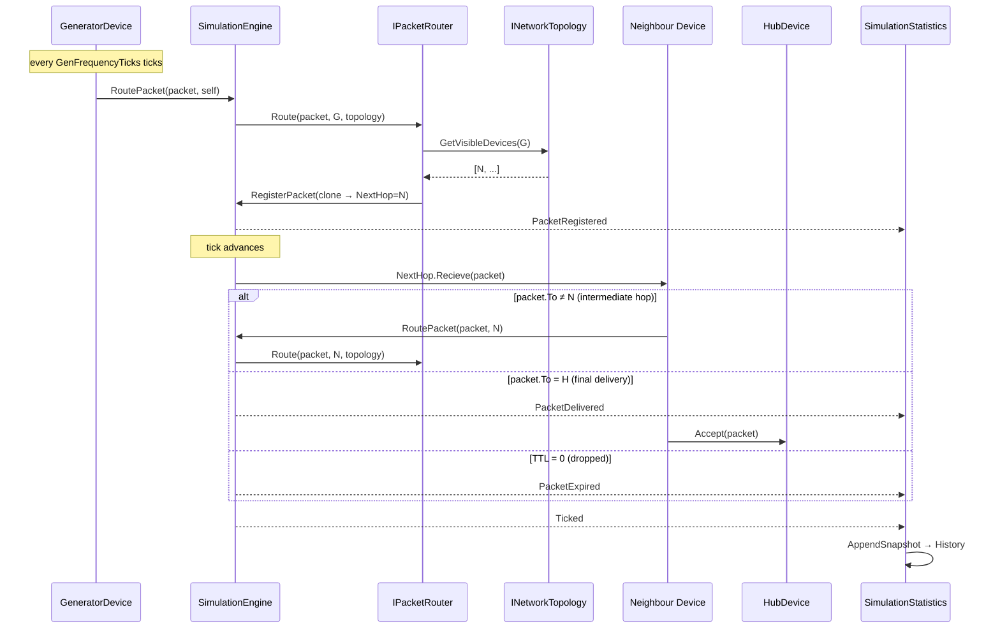

# Engine — IoT Swarm Mesh Simulation Engine

The **Engine** library is the self-contained simulation core of the IoT Swarm Mesh project.  
It models a wireless IoT network on a 2D plane: devices are placed at arbitrary positions, data packets flow between them tick-by-tick, and a pluggable routing algorithm propagates data toward the central hub.

The library has **no UI dependencies** and can be driven by any host (console, Blazor WebAssembly, test harness) that calls `SimulationEngine.Instance.Tick()`.

---

## Architecture overview

```mermaid
graph TD
    SE["SimulationEngine (singleton)\ntick loop · device registry\npacket priority queue · typed events\nRouter: IPacketRouter\nNetworkBuilder: INetworkBuilder\nTopology: INetworkTopology"]

    subgraph "Routing abstractions (Engine/Routers/)"
        IR["IPacketRouter\n«interface»\nName · Route(packet, sender, topology)"]
        IT["INetworkTopology\n«interface»\nGetVisibleDevices · GetConnectedDevices\nAreVisible · AreConnected"]
        IMT["IMutableNetworkTopology\n«interface»\nextends INetworkTopology\nConnect · Disconnect\nRemoveDevice · ClearConnections"]
        IB["INetworkBuilder\n«interface»\nName · Build(devices, topology)"]

        FPR["FloodingPacketRouter\nimplements IPacketRouter\nbroadcast to all visible neighbours"]
        NT["NetworkTopology\nimplements IMutableNetworkTopology\nadjacency set + on-the-fly visibility"]
        FMB["FullMeshNetworkBuilder\nimplements INetworkBuilder\nconnects every visible pair"]
    end

    subgraph Devices
        D["Device (abstract)\nidentity · position\nReceive → SE.RoutePacket"]
        Hub["HubDevice"]
        Gen["GeneratorDevice\nSE.RoutePacket on tick"]
        Emit["EmitterDevice"]
    end

    subgraph Packets
        P["Packet"]
        PD["PacketData"]
        CP["ConfirmationPacket"]
    end

    subgraph Events["Core/SimulationEvents.cs"]
        EV["PacketRegistered · PacketDelivered\nPacketExpired · DeviceRegistered\nDeviceRemoved · Ticked"]
    end

    SE -- "owns" --> IR
    SE -- "owns" --> IB
    SE -- "owns" --> IMT
    SE -- raises --> EV

    IR -.implements.-> FPR
    IB -.implements.-> FMB
    IMT -.implements.-> NT
    IT -.extends.-> IMT

    SE -->|TickEvent| Gen
    SE -->|RoutePacket| IR
    IR -->|Route(packet, sender, topology)| IT
    IB -->|Build(devices, topology)| IMT
    D -->|Receive → RoutePacket| SE

    Hub & Gen & Emit -->|extend| D
    CP -->|extends| P
    P -->|carries| PD
```

---

## Key concepts

### Tick-based time model

[`SimulationEngine`](Core/SimulationEngine.cs) is the singleton clock.  
Each call to `Tick()` represents one simulation step:

1. `TickCount` is incremented.  
2. Wall-clock delta time (`dt`) is measured.  
3. `TickEvent` is raised — subscribed devices perform periodic work (e.g. `GeneratorDevice` emitting a packet).  
4. All packets whose `ArrivalTick ≤ TickCount` are dequeued and dispatched to their `NextHop` device.  
5. `Ticked` is raised with the final tick count and `dt` for observers such as `SimulationStatistics`.

---

### Visibility vs. Connection

Two distinct spatial concepts are kept separate by design:

| Concept | What it means | Used for |
|---|---|---|
| **Visibility** | Euclidean distance ≤ `VisibilityDistance` | Broadcast (flooding), discovery, precondition for connection |
| **Connection** | Explicit logical link managed by `INetworkBuilder` | Unicast routing, network-topology algorithms |

A device can be visible to many neighbours but connected to only a subset of them (subject to per-device connection limits, protocol decisions, etc.).

`INetworkTopology` exposes both concepts:

```csharp
topology.GetVisibleDevices(device)   // all devices within radio range
topology.GetConnectedDevices(device) // explicitly connected neighbours
topology.AreVisible(a, b)
topology.AreConnected(a, b)
```

---

### Pluggable routing — `IPacketRouter`

[`IPacketRouter`](Routers/IPacketRouter.cs) is the single abstraction for all routing strategies.

```csharp
public interface IPacketRouter
{
    string Name { get; }
    void Route(Packet packet, Device sender, INetworkTopology topology);
}
```

The active router is stored on `SimulationEngine.Router` and can be replaced at runtime:

```csharp
SimulationEngine.Instance.Router = new MyCustomRouter();
```

Devices never reference a router directly — they call `SimulationEngine.Instance.RoutePacket(packet, this)`, which delegates to the currently configured `IPacketRouter`.

**Bundled implementations**

| Class | Strategy |
|---|---|
| [`FloodingPacketRouter`](Routers/PacketRouter.cs) | Broadcast clone to every **visible** neighbour (original behaviour) |

---

### Pluggable network formation — `INetworkBuilder`

[`INetworkBuilder`](Routers/INetworkBuilder.cs) is the abstraction for mesh-formation algorithms.

```csharp
public interface INetworkBuilder
{
    string Name { get; }
    void Build(IReadOnlyList<Device> devices, IMutableNetworkTopology topology);
}
```

The active builder is stored on `SimulationEngine.NetworkBuilder` and is called automatically whenever the device registry changes.  
It can also be replaced and re-applied at runtime:

```csharp
SimulationEngine.Instance.NetworkBuilder = new MyMeshBuilder();
SimulationEngine.Instance.RebuildTopology();
```

**Bundled implementations**

| Class | Strategy |
|---|---|
| [`FullMeshNetworkBuilder`](Routers/FullMeshNetworkBuilder.cs) | Connects every mutually visible pair (original implicit behaviour) |

---

### Network topology — `INetworkTopology` / `IMutableNetworkTopology`

[`NetworkTopology`](Routers/NetworkTopology.cs) is the live topology object owned by `SimulationEngine`.

- **Read-only view** (`INetworkTopology`) is exposed as `SimulationEngine.Topology` and passed to every `IPacketRouter.Route` call.  
- **Mutable view** (`IMutableNetworkTopology`) is passed only to `INetworkBuilder.Build` so topology mutations are centralised.

Visibility is computed on-the-fly (no caching) so it always reflects current device positions.  
Connections are an in-memory adjacency set updated by the builder.

---

### Packet lifetime

A [`Packet`](Packets/Packet.cs) carries a source (`From`), destination (`To`), next-hop device, arrival tick, and a TTL counter.  
Each hop decrements TTL; a packet reaching zero is silently dropped (raises `PacketExpired`).  
If `NeedConfirmation` is set, the destination automatically routes a [`ConfirmationPacket`](Packets/ConfirmationPacket.cs) back to the originator.

---

### GeneratorDevice send cadence

[`GeneratorDevice`](Devices/GeneratorDevice.cs) maintains an internal counter (`CurrentTickCount`) incremented on every `TickEvent`.  
When it reaches `GenFrequencyTicks` it resets to zero and one packet is emitted via `SimulationEngine.RoutePacket`:

```
tick 1 … tick N-1  →  counter increments, no packet
tick N             →  counter resets to 0, RoutePacket(packet, this) called
tick N+1 …         →  cycle repeats
```

---

### Event-driven statistics

[`SimulationStatistics`](Statistics/SimulationStatistics.cs) subscribes to the typed events raised by `SimulationEngine` and maintains eight cumulative metrics.  
On every tick it appends a [`TickSnapshot`](Statistics/TickSnapshot.cs) to a ring-buffer (capped at 300 entries) for time-series charting.  
Observers subscribe to `SimulationStatistics.Updated` to react to metric changes without polling.

---

## Project structure

| Path | Responsibility |
|---|---|
| [`Core/SimulationEngine.cs`](Core/SimulationEngine.cs) | Singleton engine: tick loop, device registry, packet queue, typed events, `Router` + `NetworkBuilder` + `Topology` |
| [`Core/SimulationEvents.cs`](Core/SimulationEvents.cs) | Strongly-typed `EventArgs` for all engine events |
| [`Devices/Device.cs`](Devices/Device.cs) | Abstract base: identity, 2D position, receive / forward via `SimulationEngine.RoutePacket` |
| [`Devices/HubDevice.cs`](Devices/HubDevice.cs) | Central gateway; destination for all `GeneratorDevice` packets |
| [`Devices/GeneratorDevice.cs`](Devices/GeneratorDevice.cs) | Emits one packet per `GenFrequencyTicks` ticks via `RoutePacket` |
| [`Devices/EmitterDevice.cs`](Devices/EmitterDevice.cs) | Receives command packets and applies a boolean state |
| [`Packets/Packet.cs`](Packets/Packet.cs) | Core transmission unit: routing metadata, TTL, payload |
| [`Packets/PacketData.cs`](Packets/PacketData.cs) | Untyped application-level payload wrapper |
| [`Packets/ConfirmationPacket.cs`](Packets/ConfirmationPacket.cs) | Delivery acknowledgement routed back to the originator |
| [`Routers/IPacketRouter.cs`](Routers/IPacketRouter.cs) | **«interface»** routing strategy contract |
| [`Routers/INetworkTopology.cs`](Routers/INetworkTopology.cs) | **«interface»** read-only topology: visibility + connections |
| [`Routers/IMutableNetworkTopology.cs`](Routers/IMutableNetworkTopology.cs) | **«interface»** topology mutations (builder-only) |
| [`Routers/INetworkBuilder.cs`](Routers/INetworkBuilder.cs) | **«interface»** network-formation strategy contract |
| [`Routers/NetworkTopology.cs`](Routers/NetworkTopology.cs) | Concrete topology: on-the-fly visibility + adjacency-set connections |
| [`Routers/PacketRouter.cs`](Routers/PacketRouter.cs) | `FloodingPacketRouter` — broadcast to all visible neighbours |
| [`Routers/FullMeshNetworkBuilder.cs`](Routers/FullMeshNetworkBuilder.cs) | `FullMeshNetworkBuilder` — connect every visible pair |
| [`Statistics/SimulationStatistics.cs`](Statistics/SimulationStatistics.cs) | Event-driven singleton: eight metrics + history ring-buffer |
| [`Statistics/StatMetric.cs`](Statistics/StatMetric.cs) | Single observable metric with display formatting and plottable flag |
| [`Statistics/TickSnapshot.cs`](Statistics/TickSnapshot.cs) | Immutable per-tick value record for time-series charting |

---

## Packet flow


```mermaid
sequenceDiagram
    participant G as GeneratorDevice
    participant SE as SimulationEngine
    participant IR as IPacketRouter
    participant IT as INetworkTopology
    participant N as Neighbour Device
    participant H as HubDevice
    participant SS as SimulationStatistics

    Note over G: every GenFrequencyTicks ticks
    G->>SE: RoutePacket(packet, self)
    SE->>IR: Route(packet, G, topology)
    IR->>IT: GetVisibleDevices(G)
    IT-->>IR: [N, ...]
    IR->>SE: RegisterPacket(clone → NextHop=N)
    SE-->>SS: PacketRegistered
    Note over SE: tick advances
    SE->>N: NextHop.Recieve(packet)
    alt packet.To ≠ N  (intermediate hop)
        N->>SE: RoutePacket(packet, N)
        SE->>IR: Route(packet, N, topology)
    else packet.To = H  (final delivery)
        SE-->>SS: PacketDelivered
        N->>H: Accept(packet)
    else TTL = 0  (dropped)
        SE-->>SS: PacketExpired
    end
    SE-->>SS: Ticked
    SS->>SS: AppendSnapshot → History
```

---

## Extensibility guide

### Adding a new routing protocol

1. Create a class in `Engine/Routers/` that implements `IPacketRouter`.
2. Use `topology.GetConnectedDevices(sender)` for unicast forwarding, or `topology.GetVisibleDevices(sender)` for broadcast.
3. Enqueue forwarded packets via `SimulationEngine.Instance.RegisterPacket(clone)`.
4. Assign it at runtime: `SimulationEngine.Instance.Router = new MyRouter();`
5. Optionally expose the choice in the Blazor UI (e.g. a `<select>` bound to a list of named `IPacketRouter` instances).

### Adding a new network-formation algorithm

1. Create a class in `Engine/Routers/` that implements `INetworkBuilder`.
2. Call `topology.Connect(a, b)` / `topology.Disconnect(a, b)` to build the desired graph. Always start with `topology.ClearConnections()` unless doing an incremental update.
3. Assign and apply: `SimulationEngine.Instance.NetworkBuilder = new MyBuilder(); SimulationEngine.Instance.RebuildTopology();`

### Comparing protocols on the same network

Because both `Router` and `NetworkBuilder` are hot-swappable properties on the singleton engine, you can:

- Run a fixed network for N ticks with protocol A → collect `SimulationStatistics`.
- Call `SimulationEngine.Instance.Router = protocolB; SimulationEngine.Instance.Reset()` → run again.
- Compare the two `SimulationStatistics` snapshots side-by-side in the UI.

### Adding a new tracked metric

1. Add a `public StatMetric MyMetric { get; }` property in [`SimulationStatistics`](Statistics/SimulationStatistics.cs) and include it in the `Metrics` array.
2. Subscribe to the relevant `SimulationEngine` event in the constructor and call `MyMetric.Increment()` or `MyMetric.Set(value)`.
3. If the metric should appear as a selectable chart series, pass `isPlottable: true` to the `StatMetric` constructor and add the corresponding `TickSnapshot` field with a mapping case in `GetSnapshotValue`.

---

## Future-proofing notes

The architecture is designed to accommodate the following planned features without breaking changes:

| Planned feature | Extension point |
|---|---|
| Visibility ≠ connection (broadcast uses range, unicast uses links) | Already separated: `GetVisibleDevices` vs `GetConnectedDevices` in `INetworkTopology` |
| Per-device connection limit (max K neighbours) | Implement `INetworkBuilder` that enforces degree constraints |
| Dynamic mesh rebuild on movement / link loss | Call `SimulationEngine.RebuildTopology()` from a tick subscriber or movement handler |
| New routing protocols (AODV, DSR, gradient…) | Implement `IPacketRouter`, swap via `SimulationEngine.Router` |
| Protocol selection in UI | Bind a `<select>` to a list of named `IPacketRouter` / `INetworkBuilder` instances on the engine |
| Per-protocol statistics comparison | Each protocol run produces an independent `SimulationStatistics` snapshot |
